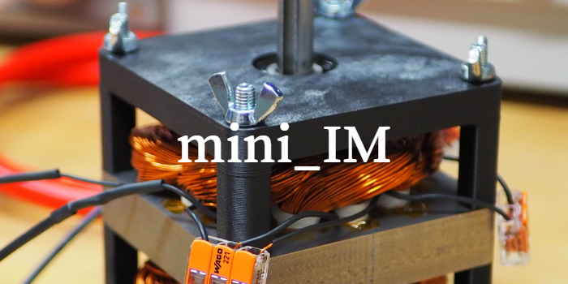
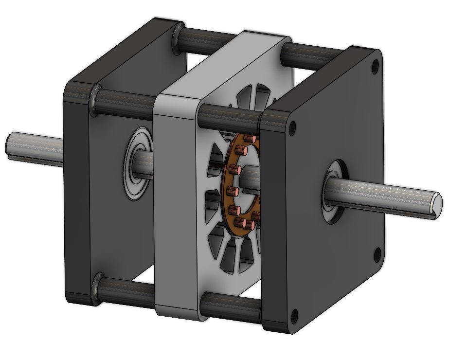
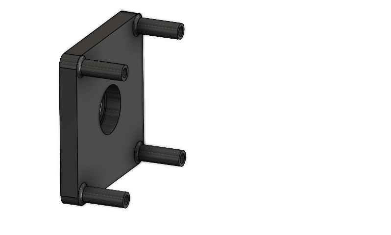

# mini_IM 

<!-- >  -->
> Compact Induction Machine with 3D Printed Housing. 
> 2021 UW-Madison Senior Design Project.

This project involves the design and prototyping of a compact, low-voltage induction machine kit for future use in UW-Madison's electrical engineering courses. Commissioned by the Grainger Teaching Studio, the kit supports a new hands-on power conversion class. This repository documents iterations developed by the senior design team.

**Team Memeber:** Anson Chan , Jon Keller, Steven Gerbers, Nathan Seibold  
**Post**: [Blog Post](https://wchan29.github.io/portfolio/wempec_induction_3d/)

### Rendering

  
  

## Bill of Materials (BOM)

### **In House Parts**
| Item                  | Description                                                    | Material     | Source           | Quantity | Specifications           | Unit Price | Total Price |
| --------------------- | -------------------------------------------------------------- | ------------ | ---------------- | -------- | ------------------------ | ---------- | ----------- |
| Motor Housing         | 2 Unique Motor Housing End Plates                              | Onyx Polymer | Stocked in House | 1        | 100mm W x 100mm L        | $25.00     | $25.00      |
| Lamination Sheet      | Stator and rotor core laminations cut from stocked sheet metal | Steel        | Stocked in House | varies   | 0.025" th x ~300 sq. in. | $5.00      | $5.00       |
| Windings              | 21 gauge insulated copper wire                                 | Copper       | Stocked in House | 1        | N/A                      | $10.00     | $10.00      |
| Rotor Fasteners       | M4 bolts and lock nuts for rotor                               | Steel        | Stocked in House | 11       | M4 thread x 16mm L       | $5.00      | $5.00       |
| Electrical Connectors | Terminals and insulated banana plugs                           | N/A          | Stocked in House | 6        | N/A                      | $0.00      | $0.00       |
| Threaded Inserts      | M4 thermal set inserts                                         | Steel        | Stocked in House | 4        | M4                       | $0.00      | $0.00       |
| Loctite               | Applied to rotor standoff fasteners                            | N/A          | Stocked in House | N/A      | N/A                      | $0.00      | $0.00       |
| Stator Slot Retainers | Small 3D-printed tabs to constrain stator coils                | Onyx Polymer | Stocked in House | 12       | N/A                      | $0.00      | $0.00       |
|                       | **Subtotal:**                                                  |              |                  |          |                          |            | **$45.00**  |

### **Purchased Parts** 
| Item                     | Description                                               | Material      | Source                               | Quantity | Specifications                      | Unit Price | Total Price |
| ------------------------ | --------------------------------------------------------- | ------------- | ------------------------------------ | -------- | ----------------------------------- | ---------- | ----------- |
| Bearings                 | 6201 open ball bearings                                   | Steel         | McMaster-Carr [5972K313]             | 2        | 12mm ID                             | $6.06      | $12.12      |
| Shaft                    | Rotary shaft with full-length keyway                      | Steel         | McMaster-Carr [7398K215]             | 1        | 200mm L x 12mm OD                   | $13.93     | $13.93      |
| Housing Fasteners        | Fasteners to secure the housing plates                    | Steel         | Fastenal [Bolts:11113709 Nuts:90673] | 4        | Bolts: M6-1 x 130mm L Nuts: M6-1 | $2.40      | $9.60       |
| Rotor End Plates         | Aluminum ring-shaped rotor end plates cut from flat stock | 6061 Aluminum | McMaster-Carr [89015K184]            | 0.125    | 0.063" th x 6" W x 12" L            | $11.53     | $1.44       |
| Aluminum Rotor Standoffs | Male female M4 threaded hex standoff for rotor cage       | 6061 Aluminum | McMaster-Carr [98952A155]            | 11       | 8mm hex x 20mm L                    | $1.62      | $17.82      |
|                          | **Subtotal:**                                             |               |                                      |          |                                     |            | **$54.91**  |
|                          | **Total:**                                                |               |                                      |          |                                     |            | **$99.91**  |

## License
[![CC BY-NC 4.0][cc-by-nc-shield]][cc-by-nc]

This work is licensed under a
[Creative Commons Attribution-NonCommercial 4.0 International License][cc-by-nc].

[![CC BY-NC 4.0][cc-by-nc-image]][cc-by-nc]

[cc-by-nc]: https://creativecommons.org/licenses/by-nc/4.0/
[cc-by-nc-image]: https://licensebuttons.net/l/by-nc/4.0/88x31.png
[cc-by-nc-shield]: https://img.shields.io/badge/License-CC%20BY--NC%204.0-lightgrey.svg
